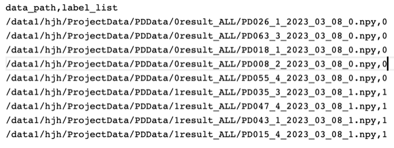

# Installation

### Prepare the environment

This repository is built in PyTorch 1.12.1 and tested on Linux version 5.4.0-146-generic environment (Python 3.8.13, CUDA Version: 11.4).
**Follow these intructions**

1. Clone our repository

```
git clone https://github.com/JackAILab/MARNet.git
cd MARNet
```

2. Make conda environment

```
conda create -n pytorch1121 python=3.8
conda activate pytorch1121
```

3. Install dependencies

`pip install packages_name` 

or

`conda install packages_name`

#### packages
All the packages contained in the .py file.

***

### Format of the dataset

First, the videos are extracted at a rate of one frame per second, and the extracted images are converted into grayscale images. Second, we take all the image data obtained every 20 frames as individual data.

These saved data paths and their labels should be written into **Data/TrainData.csv and Data/TestData.csv**.

The following are template examples for Data/TrainData.csv and Data/TestData.csv.



tips: The length of the string needs to be consistent with the example.
