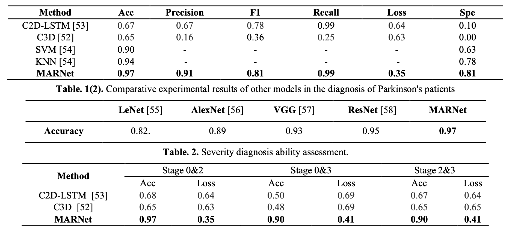
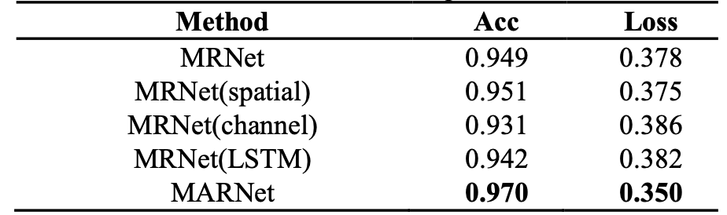

# Parkinson’s Severity Diagnosis Explainable Model Based on 3D Multi-Head Attention Residual Network

> The severity evaluation of Parkinson's disease (PD) is of great significance for the treatment of PD, and many methods have been proposed to solve this problem. However, existing methods either have limitations based on prior knowledge or are invasive methods that require wearable devices. In order to fill this research gap, we developed an explainable 3D multi-head attention residual convolution network. The proposed lightweight but effective model is expected to serve as a suitable end-to-end deep learning baseline in future research on PD video-based severity evaluation. 

***

## Installation

See [INSTALL.md](INSTALL.md) for the installation of dependencies required to run Restormer.

## Training and Testing

Training and Testing instructions for MARNet. Here is a summary table containing hyperlinks for easy navigation.

| Training Navigation                   | Testing Navigation                  |
| ------------------------------------- | ----------------------------------- |
| [TrainNavigation](TrainNavigation.md) | [TestNavigation](TestNavigation.md) |

## Results

Experiments are performed for different image processing tasks including, image deraining, single-image motion deblurring, defocus deblurring (both on single image and dual pixel data), and image denoising (both on Gaussian and real data). 

<strong>Classification Prediction Results</strong> (click to expand) 

 

<strong>Ablation Experiment Results</strong> (click to expand) 

 

## Contact

Should you have any question, please contact jiehuihuang1107@163.com
