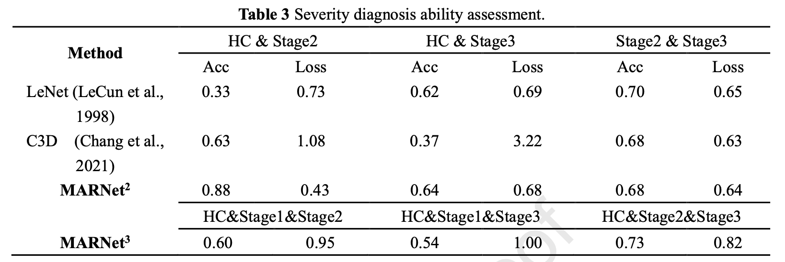
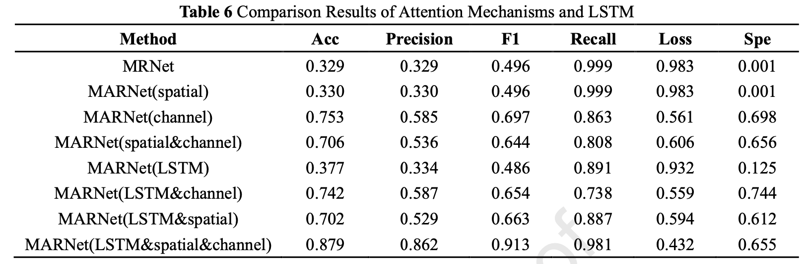

# Parkinson’s Severity Diagnosis Explainable Model Based on 3D Multi-Head Attention Residual Network

## Abstract

The severity evaluation of Parkinson’s disease (PD) is of great significance for the treatment of PD. However,
existing methods either have limitations based on prior knowledge or are invasive methods. To propose a more
generalized severity evaluation model, this paper proposes an explainable 3D multi-head attention residual
convolution network. First, we introduce the 3D attention-based convolution layer to extract video features.
Second, features will be fed into LSTM and residual backbone networks, which can be used to capture the
contextual information of the video. Finally, we design a feature compression module to condense the learned
contextual features. We develop some interpretable experiments to better explain this black-box model so that it
can be better generalized. Experiments show that our model can achieve state-of-the-art diagnosis performance.
The proposed lightweight but effective model is expected to serve as a suitable end-to-end deep learning baseline
in future research on PD video-based severity evaluation and has the potential for large-scale application in PD
telemedicine. The source code is available at https://github.com/JackAILab/MARNet.

***

## Installation

See [INSTALL.md](INSTALL.md) for the installation of dependencies required to run MARNet.

## Training and Testing

Training and Testing instructions for MARNet. Here is a summary table containing hyperlinks for easy navigation.

| Training Navigation                   | Testing Navigation                  |
| ------------------------------------- | ----------------------------------- |
| [TrainNavigation](TrainNavigation.md) | [TestNavigation](TestNavigation.md) |

## Results

In our experiments, first, we test several different models on the same dataset. Second, we also performed binary classification tests on patients of different periods and compared their results. Third, we conducted a module ablation experiment for MARNet.

<strong>Classification Prediction Results</strong> (click to expand) 

 

<strong>Ablation Experiment Results</strong> (click to expand) 

 

## Contact

Should you have any question, please contact jiehuihuang1107@163.com

## 🚩 To-Do List
- [x] Publish the training and inference code.
- [x] Deploy model in the Wechat small program [壹站医](#小程序://壹站医/PugU16YM6qKtP9m) in charge of Director [Pei Zhong](https://fahsysu.org.cn/node/870) of the First Affiliated Hospital.
- [ ] Release multi-modal diagnostic models to enhance generalization and few-shot learning capabilities.
- [ ] Continue to collect more data and update and iterate next-generation models for early screening of large-scale PD diseases.

